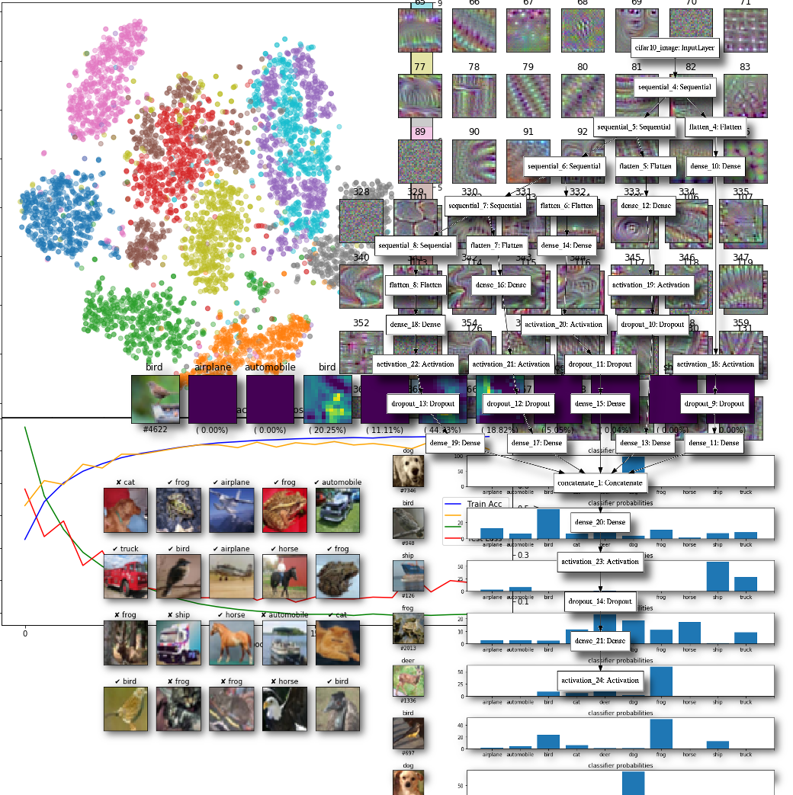

# Deep Learning from Pre-Trained Models with Keras


## Training

 The KAUST Visualization Core Laboratory (KVL) is pleased to announce a half-day introductory tutorial on Deep Learning Image Classification with Keras.  

Visualization, Computational, and Data Analytics experts from the laboratory will introduce participants to the elegant Keras deep learning programming interface to build and train TensorFlow models for image classification tasks on the CIFAR-10 / MNIST datasets.  We will demonstrate a variety of image classification CNNs (convolutional neural networks) making use of transfer learning, skip connections, data augmentation, sequential & functional APIs, and a variety of visualization techniques to create models and better understand them.  The tutorial is interactive throughout.  It provides participants experience with a variety of Python based tools inside a Jupyter notebook environment.  A final exercise provides participants the opportunity to apply what they have learned to another dataset, create their own model, and submit prediction results to Kaggle (an online community for data-scientists and machine learning practitioners) for evaluation.

This tutorial is designed as an introduction to the topic for a general, but technical audience. As a practical introduction, it will focus on tools and their application.  Previous ML (Machine Learning) experience is not required; but, previous experience with scripting in Python will help.

Participants are expected to bring their own laptops, and sign-up for free online cloud services (e.g., Google Colab, Kaggle).  They may also need to download free, open-source software prior to arriving for the workshop. Participants with valid KAUST user accounts can optionally run the notebooks from KAUST Remote Workstations.  Please see the Technical Preparations section below.

Join us to learn how to use deep learning and Keras to classify images.


### Venue, Date and Time 

  * ** Tuesday, April 6th, 2021 ** - ** 13:00 - 17:00 AST **
  * Virtual (Zoom link and invite provided via registration) 


### Registration

  * TBD


### Schedule

^ Time               ^ Topic                         ^ Speaker         ^
^ 1:00pm-4:00pm      | Tutorial                      | Glendon Holst   |
^ 4:00pm-5:00pm      | Exercise & Kaggle Submission  | KVL Team        |

**Note:** The tutorial session will be recorded for [[https://www.youtube.com/channel/UCR1RFwgvADo5CutK0LnZRrw|KAUST Visualization Core Lab ]] and/or [[https://vimeo.com/visualization|KAUST Visualization Core Lab]] and/or [[https://mediasite.kaust.edu.sa|KAUST Mediasite]].

### Tutorial Materials

* Notebooks:
  * [Tutorial Materials](https://github.com/kaust-vislab/keras-tutorials-lite)

* Datasets:
  * [https://www.cs.toronto.edu/~kriz/cifar.html](CIFAR-10)
  * [http://yann.lecun.com/exdb/mnist/](MNIST)

* Video: 
  * [https://youtu.be/NKzYiRsGEXc](Introduction to Deep Learning Image Classification with Keras - Tutorial)
  * [Introduction to Deep Learning Image Classification with Keras - Exercise](https://youtu.be/83T8VQ537sY)

* Slides: [http://download.vis.kaust.edu.sa/pub/workshops/2020/IntroToDeepLearningWithKeras/slides/keras_transfer_learning_tutorial.pdf](Tutorial PDF)


### Technical Preparation

#### Runtime Environment

Running the example notebooks requires compute resources with a GPU device to speed training.  These resource can be either in the cloud, or on a local computer.

Participants will need to bring their own laptop and charger.

You may choose between the following runtime environments:

^ Google Colab    ^ KAUST Remote Workstation   ^ Local Laptop ^
| Recommended - requires Google Account | Optional - local to KAUST | Requires NVIDIA GPU + Installation & Setup   |


#### Google Colab

To run the notebooks in [https://colab.research.google.com](Google Colab) you will need a [https://accounts.google.com/](Google Account).  Sign-in to your Google account, if necessary, and then start the Tutorial / Exercise Notebook by clicking the buttons below:

* Tutorial: [](https://colab.research.google.com/github/kaust-vislab/keras-tutorials-lite/blob/master/notebooks/keras-transfer-learning-tutorial.ipynb)
* Exercise: [](https://colab.research.google.com/github/kaust-vislab/keras-tutorials-lite/blob/master/notebooks/keras-mnist-kaggle-exercise.ipynb)

Then follow the *Setup Colab* instructions in the notebook.


#### Local

Requires:

  * NVIDIA GPU – Performance required to follow tutorial in allotted time.
  * Conda [https://docs.conda.io/en/latest/miniconda.html](Miniconda Installers).
  * git + LFS [https://git-lfs.github.com/](Git Large File Storage)
  * Access to [https://gitlab.kaust.edu.sa](KAUST GitLab)

To work locally on your own laptop or workstation, use the [Conda](https://docs.conda.io/en/latest/miniconda.html) package managment system to create a work environment with the required software. After installing miniconda (above), follow these steps to setup the work environment and run the tutorial:

Create the environment...

```bash
conda env create --prefix ./env --file environment-gpu.yml
```

...then activate the environment...

```bash
conda activate ./env
```

...then launch the Jupyter Notebook server.

```bash
jupyter notebook notebooks/keras-transfer-learning-tutorial.ipynb
```


### Speaker Bios

Glendon Holst is a Staff Scientist in the Visualization Core Lab at KAUST (King Abdullah University of Science and Technology) specializing in HPC workflow solutions for deep learning, image processing, and scientific visualization.

David R. Pugh is a Staff Scientist in the Visualization Core Lab at KAUST (King Abdullah University of Science and Technology) specializing in Data Science and Machine Learning. David is also a certified Software and Data Carpentry Instructor and Instructor Trainer and is the lead instructor of the Introduction to Data Science Workshop series at KAUST.


### History

ImageNet, an image recognition benchmark dataset*, helped trigger the modern AI explosion.  In 2012, the AlexNet architecture (a deep convolutional-neural-network) rocked the ImageNet benchmark competition, handily beating the next best entrant.  By 2014, all the leading competitors were deep learning based.  Since then, accuracy scores continued to improve, eventually surpassing human performance.


### References

* https://qz.com/1034972/the-data-that-changed-the-direction-of-ai-research-and-possibly-the-world/
* https://www.cs.toronto.edu/~kriz/cifar.html
* http://yann.lecun.com/exdb/mnist/index.html
* 
  * https://towardsdatascience.com/transfer-learning-from-pre-trained-models-f2393f124751
  * https://towardsdatascience.com/keras-transfer-learning-for-beginners-6c9b8b7143e
  * https://machinelearningmastery.com/how-to-improve-performance-with-transfer-learning-for-deep-learning-neural-networks/
* https://towardsdatascience.com/deep-learning-at-scale-accurate-large-mini-batch-sgd-8207d54bfe02
* 
  * https://arxiv.org/abs/1409.1556
  * https://arxiv.org/abs/1610.02391
* https://www.kaggle.com/c/digit-recognizer
* https://jupyter-notebook.readthedocs.io/en/stable/
* https://github.com/kaust-vislab/handson-ml2
* 
  * https://keras.io/examples/cifar10_cnn/
  * https://keras.io/examples/cifar10_resnet/

